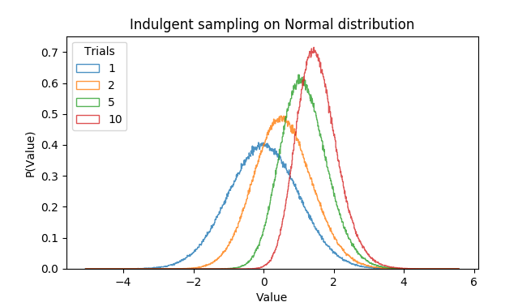
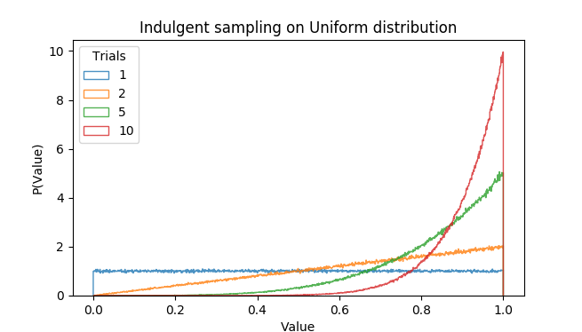

# Illustration of indulgent sampling

## Rationale
The idea is to modify Thompson sampling to take the max of several samples before deciding on an action. Effectivly this will push the mass of the distibutions to the right, as illustrated in this document. I speculate that this is helpful for exploration under the assumption that *optimism in face of uncertainty* is good.

### Mathematical description
Largest order statistic of some number of i.i.d. variables that have the original distribution. 

### Why this trial-based method?
This method naturally works with algorithms that make use of singe-point estimates for parametric distributions, like drop out.

## Some indulgently sampled distributions
Note that trial-count of one gives the original distribution.

### Normal distribution

### Uniform distribution

This is the beta-distribution, which is the conjugate distribution for binomial trials. Interpreted as a bayesian conjugate-prior for a binomial experiment, each trial count gives a positive bit of evidence. I'm not sure what intuition this gives for the general case.